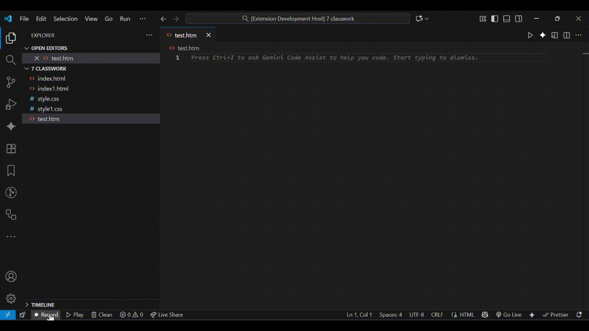

# CodeReplay - Record and Replay Your Coding Sessions 🎬

CodeReplay is a simple, powerful VS Code extension built for developers, educators, and content creators.

Stop re-recording your tutorials because of a typo. CodeReplay records your coding session—mistakes and all—and plays back a perfect, clean timelapse that you can record for your videos.

## Features

* **1-Click Recording:** Start and stop recording at any time with simple buttons in the status bar.
* **Snapshot Recording:** Only records the *changes* you make to your files from the moment you press "Record."
* **Clean Playback:** Plays back your session by creating new `(playback)` files, giving you a perfectly clean animation every time.
* **Multi-File Support:** Seamlessly records and replays your edits as you jump between different files (e.g., `index.html` and `style.css`).
* **Easy Cleanup:** A one-click `$(trash) Clean` button to instantly find and delete all generated playback files.

## How to Use

1.  **Record:** Click the `● Record` button in the status bar to start recording your active files.
2.  **Code:** Write your code, create new files, and switch between tabs. CodeReplay will capture everything.
3.  **Stop:** Click the `■ Stop` button when you're finished.
4.  **Play:** Click the `▶ Play` button. The extension will create new `(playback)` files and re-type your session from start to finish.
5.  **Clean:** Once you've captured your video, click the `$(trash) Clean` button to delete all generated playback files.

---

### ## The Workflow in Action

`[Image or GIF of the extension working]`

---

## Upcoming Features (Roadmap)

* **Playback Speed Control:** Set the playback speed for faster timelapses.
* **Save & Share Recordings:** Save your recordings to a `.replay` file that you can edit, share, or play back later.
* **The "Director's Cut":** A timeline editor to remove mistakes from your recordings.

## Feedback & Contributions

This is a new project, and all feedback is welcome! If you find a bug or have a feature idea, please open an issue on the [GitHub repository](https://github.com/Rokan0-0/CodeReplay).

---
**Enjoy!**